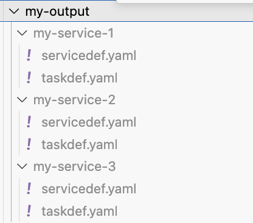
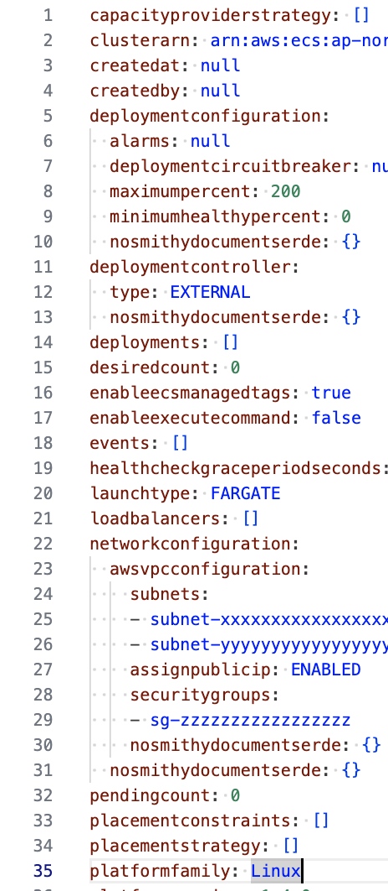
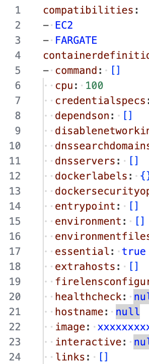

# ecsdef-export

Fetch and export ECS definitions (service&amp;taskdef) to files

## Expected
<!-- 

```sh
$ go run main.go --cluster my-cluster --outdir ./output 
Found 3 services
 1. Export succeeded: my-service-1
 2. Export succeeded: my-service-2
 3. Export succeeded: my-service-3
Successfully finished exporting.
``` -->

You can fetch ECS configs like:



servicedef.yaml:


taskdef.yaml



## How to use it

- Prerequisites
  - You have golang
  - You can execute AWS commands to your AWS account.

1. Execute the following command.

    ```sh
    go run main.go --cluster <YOUR_ECS_CLUSTER_NAME> --outdir ./YOUR/TARGET/DIR
    ```

2. (optional) If you want to remove unnecessary fields from the generated files, execute the following command.

    ```sh
    find ./YOUR/TARGET/DIR -type f -exec sed -i '' \
    -e '/nosmithydocumentserde:/d' \
    -e '/createdat:/d' \
    -e '/createdby:/d' \
    -e '/deployments:/d' \
    -e '/events:/d' \
    -e '/loadbalancers:/d' \
    -e '/pendingcount:/d' \
    -e '/runningcount:/d' \
    -e '/status:/d' \
    -e '/tasksets:/d' \
    -e '/deregisteredat:/d' \
    -e '/registeredat:/d' \
    -e '/registeredby:/d' {} \;
    ```